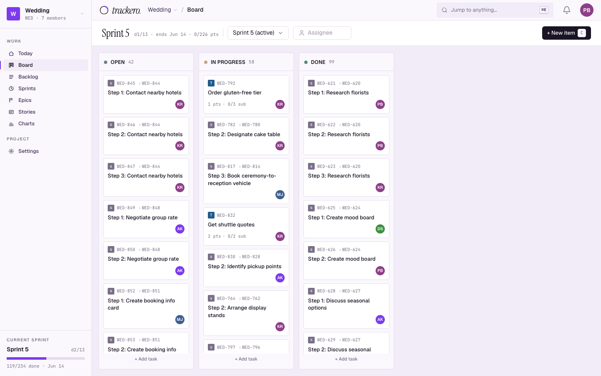
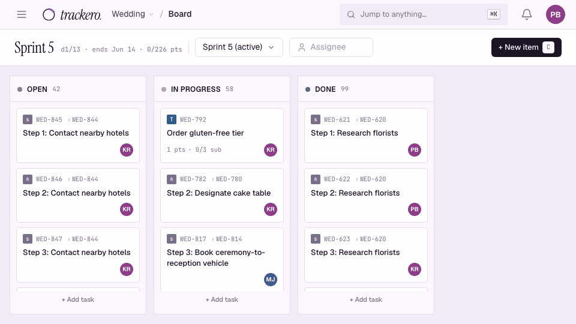
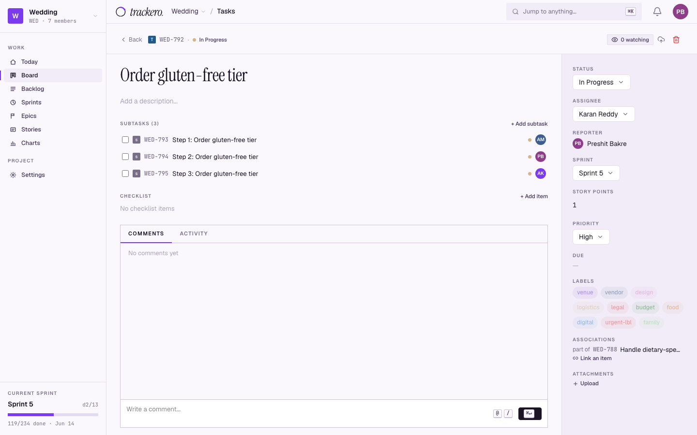
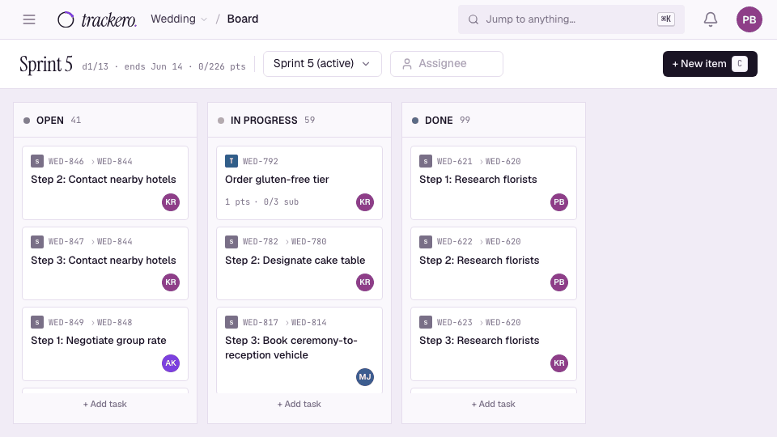
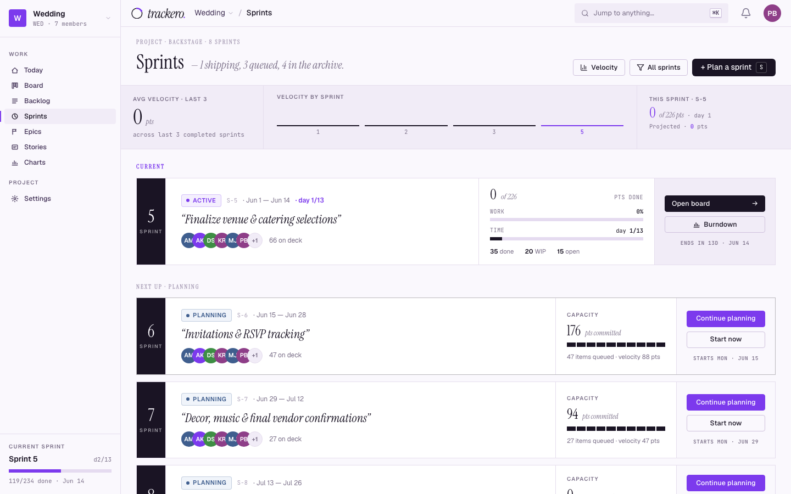
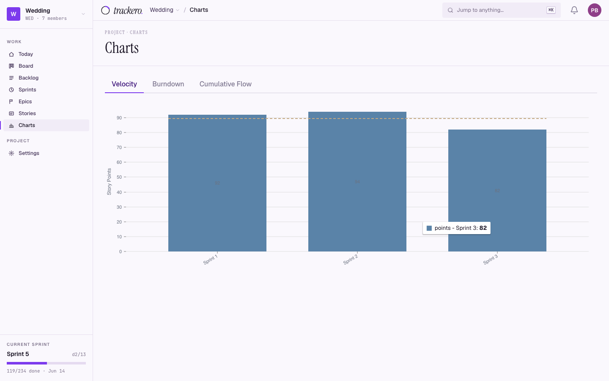
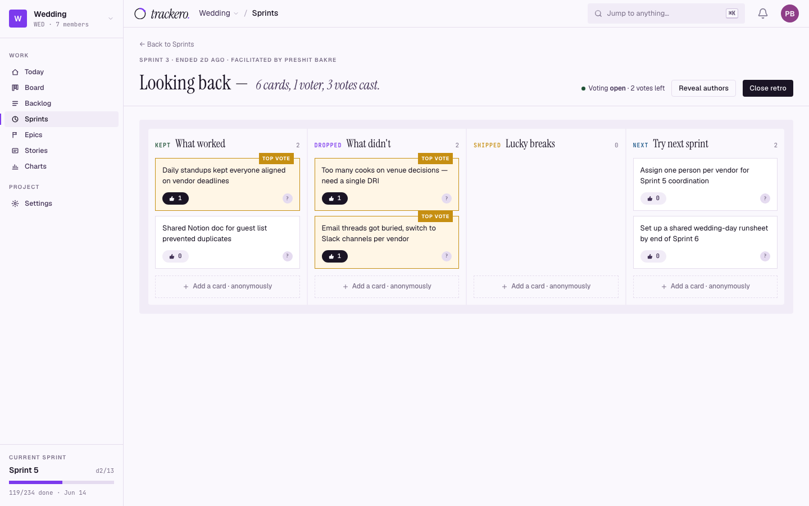
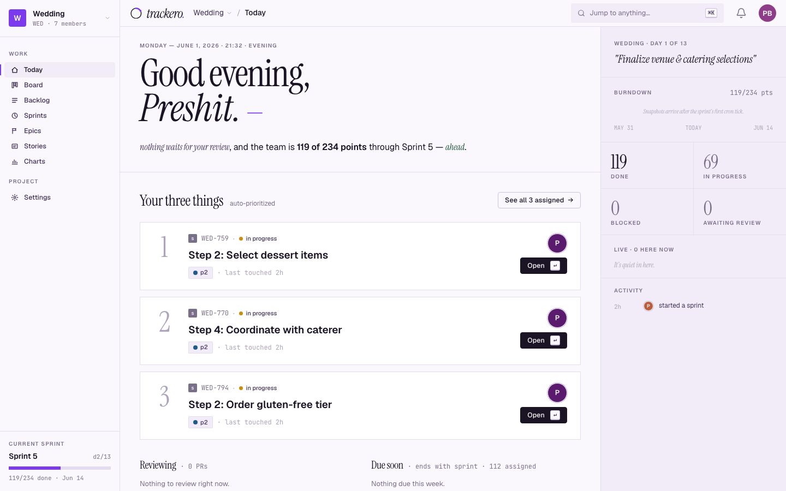
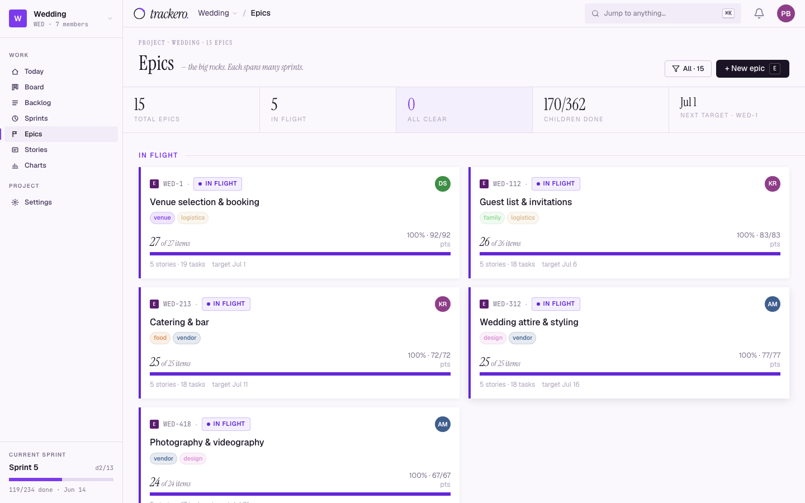
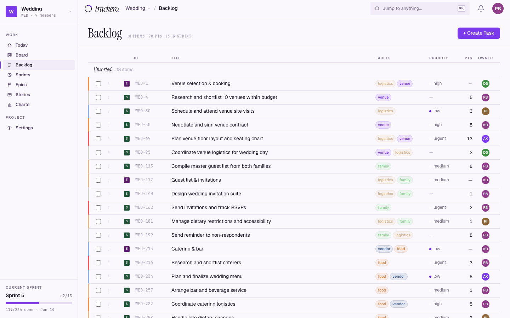

# Trackero

### A full project management platform. Built in two weeks. Ships everything.

Trackero is a self-hosted, real-time project management application for small-to-mid-size product teams. Sprints, epics, stories, Kanban boards, retrospectives, charts, full-text search, file attachments, role-based access, in-app notifications, and a keyboard-first interface.

> **Not a prototype. Not a demo.**
>
> - **157** API endpoints across **36** feature areas
> - **35** database tables
> - **22** pages

Built by [BlueAgate](https://blueagate.in) as a capability showcase. If you're wondering what a small, focused team can ship when the engineering is right, this is the answer.



---

## Why This Exists

Most "project management" side projects are a Kanban board with drag-and-drop and a login page. Trackero is the whole thing: sprint lifecycle management, epic-to-subtask hierarchy four levels deep, association graphs with circular dependency detection, real-time presence, event-driven architecture with 18+ internal event types, cumulative flow diagrams, and a first-run setup wizard that uses `pg_advisory_lock` to guarantee exactly one admin under concurrent requests.

We built it in two weeks to prove a point: that a small studio with the right engineering practices can ship production-grade software at a pace that surprises people. Every feature is complete. Every edge case is handled. Every page works.

---

## Features

### Project Execution
- **Sprint management** with full lifecycle: planning, active, completed, cancelled
- **Kanban board** with drag-and-drop, real-time sync, and swimlane views

  
- **Backlog** with bulk actions, drag-to-sprint, and priority sorting
- **Burndown and velocity charts** with cumulative flow diagrams

### Work Item Hierarchy
- **Epics** with 7 display states, milestone tracking, and progress rollup
- **Stories** with acceptance criteria, approval workflows, and epic grouping
- **Tasks and bugs** with checklists, subtasks, and point estimation (Fibonacci)
- **Associations** — belongs_to, relates_to, blocks, caused_by — with virtual reciprocals and cycle detection

  

### Collaboration
- **Real-time updates** via Socket.IO with presence indicators (who's viewing what)
- **Comments** with @mention autocomplete and bracket syntax rendering
- **File attachments** on any work item (S3/MinIO with presigned URLs)
- **Activity audit trail** on every entity

### Team Management
- **4-tier RBAC** — Admin, Project Manager, Member, Viewer
- **Invite-only registration** with 7-day expiry tokens
- **In-app + email notifications** with read/unread, mark-all, preferences
- **Retrospectives** — three-column retro boards with anonymous voting

### Navigation & Search
- **Command palette** (Cmd+K) with fuzzy matching across all entities
- **Full-text search** powered by PostgreSQL tsvector with relevance ranking
- **Keyboard-first** — 15+ shortcuts for navigation, creation, and assignment
- **Today page** — personalized view of assigned items, recent activity, due soon

  

---

## Tech Stack

| Layer | Technology |
|-------|-----------|
| **Backend** | NestJS, TypeORM, PostgreSQL 15, Passport JWT, EventEmitter2 |
| **Frontend** | React 19, React Router v7, Tailwind CSS, Zustand, TanStack Query |
| **Real-time** | Socket.IO (WebSocket transport, room-based project channels) |
| **UI primitives** | Radix UI (11 packages), @dnd-kit, @nivo, CVA |
| **File storage** | MinIO / S3-compatible (@aws-sdk/client-s3) |
| **API docs** | Swagger/OpenAPI at `/api/docs` |
| **Infra** | Docker multi-stage build, docker-compose (app + Postgres + MinIO) |
| **Security** | bcrypt (cost 12), SHA-256 token hashing, helmet, rate limiting |

---

## Quickstart

### Docker Compose

```bash
git clone https://github.com/preshitbakre/trackero.git
cd trackero

# Create your .env from the example
cp backend/.env.example backend/.env

# Set at minimum: JWT_SECRET
# Then start everything
docker compose up -d
```

The app is at `http://localhost:3000`. MinIO console at `http://localhost:9001`.

On first visit, a setup wizard walks you through creating the admin account and inviting your team. The first user to sign up becomes the admin. Migrations run automatically on startup.

### Local Development

```bash
# Prerequisites: Node 20+, PostgreSQL 15+

# Backend
cd backend
cp .env.example .env    # Edit with your DB credentials and JWT_SECRET
npm install
npm run migration:run
npm run start:dev       # API at http://localhost:3001

# Frontend (separate terminal)
cd frontend
npm install
npm run dev             # App at http://localhost:5173

# Swagger docs at http://localhost:3001/api/docs
```

### Environment Variables

Copy `.env.example` to `.env` and configure. The example file is annotated — here's the full reference:

**Server**

| Variable | Required | Default | Description |
|----------|----------|---------|-------------|
| `NODE_ENV` | No | `development` | `development` enables auto-sync of DB schema. `production` requires migrations (run by the Docker `migrate` service). |
| `PORT` | No | `3001` | Port the backend listens on. In Docker, nginx proxies to this internally. |
| `APP_URL` | No | `http://localhost:5173` | Base URL used in email links and CORS origin. Set to your public URL in production. |

**Database (PostgreSQL)**

| Variable | Required | Default | Description |
|----------|----------|---------|-------------|
| `DATABASE_HOST` | Yes | `localhost` | PostgreSQL host. In Docker, use the service name `postgres`. |
| `DATABASE_PORT` | No | `5432` | PostgreSQL port. |
| `DATABASE_USERNAME` | Yes | — | DB user. In Docker, the app uses `trackero_app` (DML-only); the migrate service uses `trackero_admin` (DDL). |
| `DATABASE_PASSWORD` | Yes | — | Password for the DB user. |
| `DATABASE_NAME` | Yes | `trackero` | Database name. |
| `DATABASE_SSL` | No | `false` | Set to `true` for SSL connections (e.g., cloud-hosted Postgres). |

**Auth**

| Variable | Required | Default | Description |
|----------|----------|---------|-------------|
| `JWT_SECRET` | **Yes** | — | Random 64+ character string for signing access and refresh tokens. Generate with `openssl rand -hex 32`. |
| `ACCESS_TOKEN_EXPIRY` | No | `15m` | How long access tokens are valid (`15m`, `1h`, etc.). |
| `REFRESH_TOKEN_EXPIRY` | No | `7d` | How long refresh tokens are valid. |

**File Storage (MinIO / S3)**

| Variable | Required | Default | Description |
|----------|----------|---------|-------------|
| `STORAGE_DRIVER` | No | `s3` | Storage backend. Currently only `s3` (MinIO-compatible). |
| `MINIO_ENDPOINT` | No | `localhost` | MinIO/S3 host. In Docker, use the service name `minio`. |
| `MINIO_PORT` | No | `9000` | MinIO API port. |
| `MINIO_ACCESS_KEY` | No | `minioadmin` | MinIO root access key. |
| `MINIO_SECRET_KEY` | No | `minioadmin` | MinIO root secret key. Change in production. |
| `MINIO_BUCKET` | No | `trackero-files` | Bucket name for file uploads. Created automatically if it doesn't exist. |
| `MINIO_USE_SSL` | No | `false` | Set to `true` when connecting to MinIO/S3 over HTTPS. |
| `PRESIGNED_URL_EXPIRY` | No | `1800` | Presigned URL TTL in seconds (default: 30 minutes). |
| `MAX_UPLOAD_SIZE_MB` | No | `10` | Maximum file upload size in MB. |

**Email (SMTP)**

| Variable | Required | Default | Description |
|----------|----------|---------|-------------|
| `SMTP_HOST` | No | — | SMTP server hostname. Leave empty to disable email (notifications log to console instead). |
| `SMTP_PORT` | No | `587` | SMTP port. Use `587` for STARTTLS, `465` for SSL. |
| `SMTP_USER` | No | — | SMTP username. For Gmail, use your email address. |
| `SMTP_PASS` | No | — | SMTP password. For Gmail, use an [App Password](https://myaccount.google.com/apppasswords). |
| `SMTP_FROM` | No | `noreply@trackero.dev` | Sender address for outgoing emails. |

**Swagger**

| Variable | Required | Default | Description |
|----------|----------|---------|-------------|
| `SWAGGER_ENABLED` | No | `false` | In non-production, Swagger UI at `/api/docs` is always on. In production, set to `true` to enable it. |

**Rate Limiting**

| Variable | Required | Default | Description |
|----------|----------|---------|-------------|
| `THROTTLE_TTL` | No | `60000` | General rate-limit window in milliseconds. |
| `THROTTLE_LIMIT` | No | `30` | Max requests per window for general endpoints. |
| `AUTH_THROTTLE_TTL` | No | `60000` | Rate-limit window for auth endpoints (login, register). |
| `AUTH_THROTTLE_LIMIT` | No | `5` | Max requests per window for auth endpoints. Lower to prevent brute-force. |

---

## Architecture

```
trackero/
├── backend/                 NestJS API (157 endpoints)
│   ├── src/
│   │   ├── auth/            JWT auth, setup wizard, password reset
│   │   ├── users/           User management, invitations
│   │   ├── projects/        Projects, members, statuses, labels
│   │   ├── epics/           Epic lifecycle with milestones
│   │   ├── sprints/         Sprint planning, scope tracking, auto-retro
│   │   ├── tasks/           Work items, subtasks, checklists, watchers
│   │   ├── board/           Kanban with lexorank ordering
│   │   ├── comments/        @mention parsing and notification dispatch
│   │   ├── attachments/     S3 upload/download with presigned URLs
│   │   ├── activity/        Event-driven audit trail
│   │   ├── notifications/   In-app + email with preference control
│   │   ├── gateway/         Socket.IO: presence, live updates, room mgmt
│   │   ├── charts/          Velocity, burndown, cumulative flow
│   │   ├── retrospectives/  3-column retro boards with voting
│   │   ├── search/          Full-text search (tsvector + ILIKE fallback)
│   │   └── common/          Guards, interceptors, response codes, DTOs
│   └── migrations/          TypeORM migrations (auto-run on startup)
├── frontend/                React 19 SPA (22 pages)
│   └── src/
│       ├── pages/           Route-level components
│       ├── components/      26 UI + 17 common components
│       ├── hooks/           Keyboard shortcuts, roles, debounce
│       ├── store/           Zustand auth store
│       ├── api/             Axios client with token refresh + dedup
│       └── lib/             Socket.IO, lexorank, design tokens
├── Dockerfile               Multi-stage production build
└── docker-compose.yml       App + PostgreSQL 15 + MinIO
```

### Design Decisions

**Event-driven backend.** Cross-module communication runs through NestJS EventEmitter2 with 18+ event types. When a work item moves on the board, that single action fans out to activity logging, sprint scope recalculation, webhook dispatch, Socket.IO broadcast, and directory stats update. Modules stay decoupled. Adding a new side effect means adding a listener, not touching the move endpoint.

**Association model instead of simple foreign keys.** Work item relationships (blocks, caused_by, relates_to, belongs_to) live in a dedicated `work_item_associations` table. Virtual reciprocals (e.g., `contains` is the inverse of `belongs_to`) are computed at read time. Circular dependency detection runs a recursive CTE before any blocking link is created.

**Lexorank ordering.** Board columns and backlog items use fractional string indexing instead of integer positions. Moving a card between two others computes a midpoint string. No reindexing of sibling rows on every drag. Rebalancing only triggers when the string space is exhausted.

**Real-time with rooms.** Socket.IO connections join project-specific rooms. Events broadcast only to users in the same project. Presence tracking (who's viewing which page) updates on navigation, with automatic cleanup on disconnect.

**First-run safety.** The setup wizard uses `pg_advisory_xact_lock` to guarantee exactly one admin is created, even if two browsers hit `/setup` simultaneously. No race conditions. No duplicate admins.

---

## Database

35 tables, 55 foreign key relationships. Key entities:

| Table | Purpose |
|-------|---------|
| `users` | Auth, profile, tokenVersion for session invalidation |
| `projects` | Multi-tenant project container |
| `project_members` | RBAC: admin/pm/member/viewer per project |
| `work_items` | Unified table for epics, stories, tasks, bugs, subtasks |
| `work_item_associations` | Typed links: belongs_to, relates_to, blocks, caused_by |
| `sprints` | Lifecycle: planning → active → completed/cancelled |
| `project_statuses` | Per-project status workflow (backlog, in_progress, done) |
| `comments` | Threaded comments with @mention metadata |
| `attachments` | S3 references with MIME type and size |
| `notifications` | In-app notifications with read tracking |
| `activity_log` | Immutable audit trail with before/after snapshots |
| `retrospective_items` | 3-column retro with anonymous vote counts |

---

## API

All endpoints return a standard envelope:

```json
{
  "success": true,
  "code": "S-0101",
  "data": { ... },
  "message": "Task created"
}
```

Interactive documentation at `/api/docs` (Swagger UI). 157 endpoints across auth, projects, work items, sprints, epics, board, comments, attachments, notifications, charts, retrospectives, search, integrations, and more.

---

## Keyboard Shortcuts

| Key | Action |
|-----|--------|
| `Cmd+K` | Command palette |
| `C` | Create new item |
| `/` | Focus search |
| `G` then `B` | Go to board |
| `G` then `L` | Go to backlog |
| `G` then `S` | Go to sprints |
| `G` then `E` | Go to epics |
| `M` | Assign to me |
| `?` | Show all shortcuts |


---

## Screenshots

| Sprint management | Velocity charts | Retrospective board |
|:-:|:-:|:-:|
|  |  |  |

| Today page | Epics | Backlog |
|:-:|:-:|:-:|
|  |  |  |

---

## License

[AGPL-3.0](LICENSE)

---

## Built by BlueAgate

Trackero was built by [BlueAgate](https://blueagate.in), a boutique product studio. We ship production-grade software, fast.

If you need something built, and you need it built right, [get in touch](https://blueagate.in).
